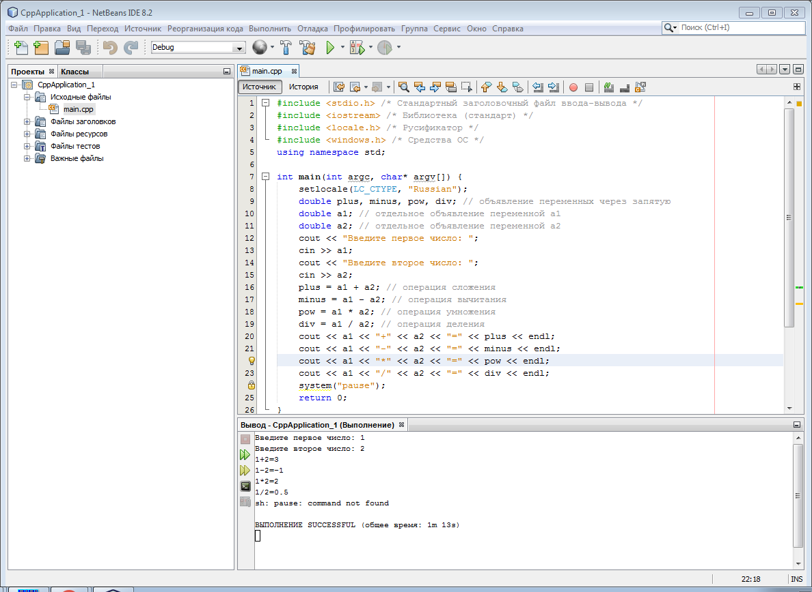
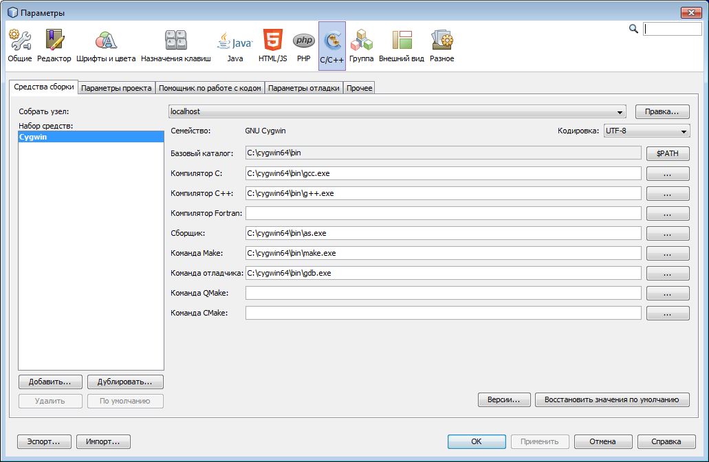

# CppApplication(windows)
Пример простейшей программы на C++ в NetBeans для платформы Windows (Cygwin)





# Код программы:

```
#include <stdio.h> /* Стандартный заголовочный файл ввода-вывода */
#include <iostream> /* Библиотека (стандарт) */
#include <locale.h> /* Русификатор */
#include <windows.h> /* Средства ОС */
using namespace std;

int main(int argc, char* argv[]) {
    setlocale(LC_CTYPE, "Russian");
    double plus, minus, pow, div; // объявление переменных через запятую
    double a1; // отдельное объявление переменной a1
    double a2; // отдельное объявление переменной a2
    cout << "Введите первое число: ";
    cin >> a1;
    cout << "Введите второе число: ";
    cin >> a2;
    plus = a1 + a2; // операция сложения
    minus = a1 - a2; // операция вычитания
    pow = a1 * a2; // операция умножения
    div = a1 / a2; // операция деления
    cout << a1 << "+" << a2 << "=" << plus << endl;
    cout << a1 << "-" << a2 << "=" << minus << endl;
    cout << a1 << "*" << a2 << "=" << pow << endl;
    cout << a1 << "/" << a2 << "=" << div << endl;
    system("pause");
    return 0;
}

```


